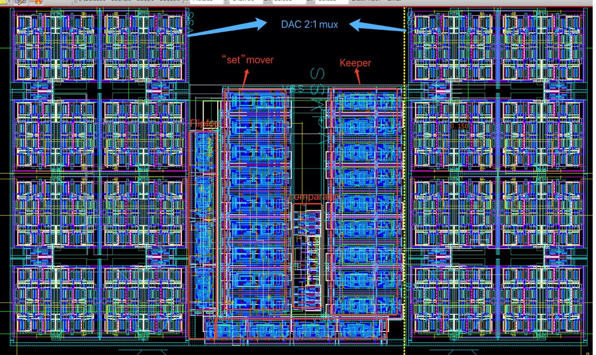

# SAR ADC with Centroid Layout | Mixed-Signal, VLSI， Analog design

This repository contains the **design, layout, and simulation results** of an **8-bit Successive Approximation Register (SAR) ADC**, implemented with **full post-layout parasitic extraction (PEX)** and achieving a **verified 10 MHz sampling rate** with a **30 dB signal-to-noise ratio (SNR)**.

## Features

- **8-bit SAR ADC Design**  
  - Successfully implemented a **Successive Approximation Register (SAR) ADC** with a **verified 10 MHz sampling rate**.
  - Designed a **centroid-matched R-2R ladder Digital-to-Analog Converter (DAC)** for high-precision conversion.
  - Developed a **register-based SAR control logic** for efficient operation.

- **Full-Custom Layout & Post-Layout Extraction (PEX)**  
  - Designed a **full-custom analog layout** with **density-driven floorplanning**, achieving **85% area utilization**.
  - Ensured **Design Rule Check (DRC) clean** and **Layout vs. Schematic (LVS) verified** layout.
  - Implemented **centroid geometry matching** for critical analog blocks to enhance performance.

- **Performance & Simulation**  
  - Achieved **8-bit resolution** with an input range of **0.25V to 1.2V**.
  - Simulated performance verified at multiple frequencies (**100KHz, 500KHz, 1MHz**).
  - Measured **post-layout signal integrity**, ensuring minimal degradation between pre- and post-layout simulations.
  - Evaluated **temperature drifting effects** and mitigated design defects.

## Project Structure

## Full-Custom Layout

Below is the **final SAR ADC layout**, showcasing the **SAR logic, DAC, and Comparator**.

- **Total Area:** **1681 µm²** (55 × 34 µm²)
- **Total Instances:** **1338**
- **Resolution:** **8 Bits**
- **Input Voltage Range:** **0.25V ~ 1.2V**
- **Sampling Frequency:** **10 MHz**
- **Post-Layout Extraction (PEX):** Ensured minimal performance degradation

## Simulation Results

### **Pre & Post-Layout Comparison**
- Verified **consistent resolution** of **8 mV per step**.
- **Transition time (Tr < 1 ns)** remains stable across different conditions.
- **LVS & PEX verified**, ensuring performance integrity.

### **Performance at Different Frequencies**
- **100KHz:** Verified with **30 dB SNR**.
- **500KHz - 1MHz:** Analyzed parasitic effects and signal integrity.
- **1MHz (Pre vs. Post Layout):** Minimal deviation observed.

### **Temperature Drifting Analysis**
- Evaluated SAR ADC performance under varying thermal conditions.
- Ensured robustness against voltage and temperature variations.

## How to Use

### 1. View the Design Files
- Open the `layout/` directory to inspect **GDSII layout** and **schematics**.
- Explore `simulation/` for pre- and post-layout analysis.

### 2. Run Simulations
- Load the **GDS** file into **Cadence Virtuoso** or **Magic VLSI** for layout inspection.
- Run **Spectre** or **HSPICE** for post-layout simulation.

### 3. Review Documentation
- The `docs/` folder contains a **detailed design report** and **presentation slides** summarizing the results.

## License

This project is for **educational and research purposes**. [Insert your preferred license here.]

## Acknowledgements

Special thanks to **Yi Tong** for the **design, layout, and analysis** of this **SAR ADC**. For any inquiries or contributions, feel free to open an issue or submit a pull request!
